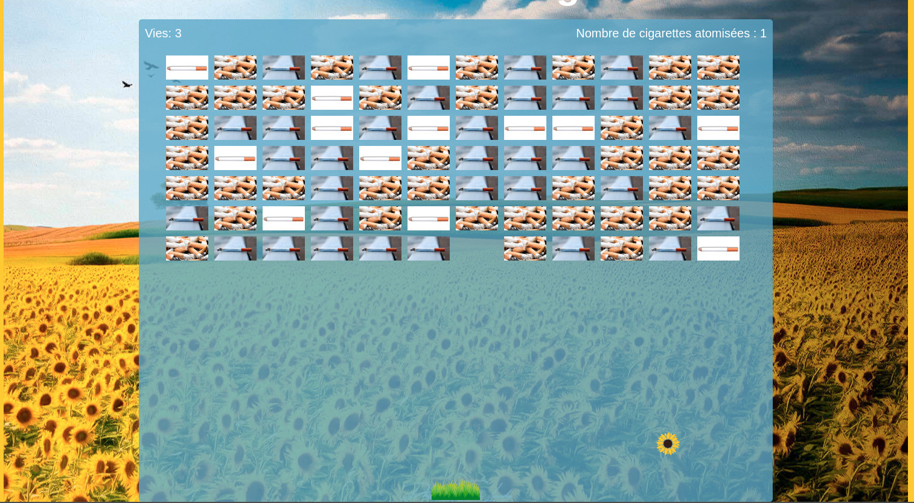

# JavaScript Brick Breaker DOM Game

## Description

**Brick Breakout** is an engaging game where players aim to break as many bricks as possible by bouncing a ball off a paddle. Built with the trifecta of web technologies - HTML, CSS, and JavaScript, this game offers hours of fun paired with vibrant visuals.

## Features

- **Objective-Based Gameplay**: Break bricks while ensuring the ball doesn't fall off the paddle.
- **Dynamic Interface**: The game area, including bricks and paddle, is dynamically rendered using JavaScript.
- **Score Tracking**: Keep track of scores and try to beat the highest score.
- **Game States**: The game intelligently handles different states such as 'start', 'playing', 'paused', and 'over'.
- **Configurable Settings**: Adjust game settings, such as the number of brick rows and columns.

## Styling Highlights

- **Vibrant Background**: A gradient background that sets the gaming mood.
- **Responsive Design**: The game layout and elements adjust to fit various screen sizes, offering a seamless gaming experience.
- **Interactive Buttons**: Buttons with hover and active effects for better user feedback.
- **Customizable Themes**: Elements like the game canvas and buttons can be easily themed for a fresh look.

## JavaScript Techniques

- **DOM Manipulation**: Extensive use of the Document Object Model (DOM) to create and control game elements.
- **Event Handling**: Listeners for game events like button clicks and paddle movements.
- **Game Logic**: Algorithms and logic to handle ball movements, collisions, and scoring.
- **State Management**: Efficient handling of various game states for a smooth user experience.
